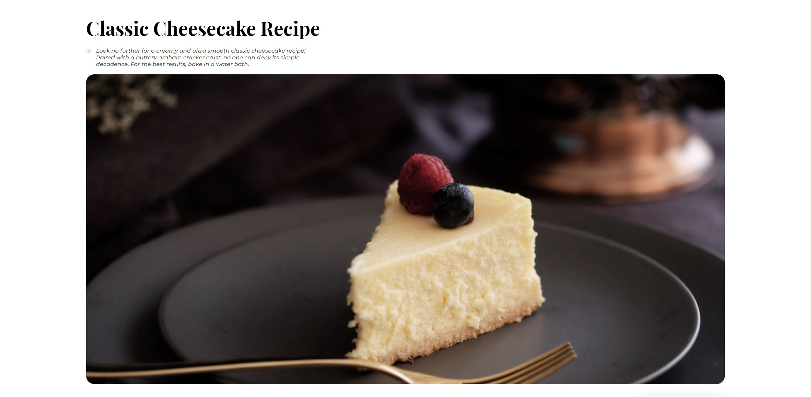

<!-- Please update value in the {}  -->

<h1 align="center">Recipe Blog</h1>

   Solution for a challenge from  <a href="http://devchallenges.io" target="_blank">Devchallenges.io</a>.

  <h3>
    <a href="https://dev-challenges-recipe-blog.vercel.app/">
      Demo
    </a>
     | 
    <a href="https://devchallenges.io/solutions/qqRddQvB68ME0GvKyDQr">
      Solution
    </a>
     | 
    <a href="https://devchallenges.io/challenges/OEKdUZ6xs0h99C38XVht">
      Challenge
    </a>
  </h3>

<!-- TABLE OF CONTENTS -->

## Table of Contents

- [Overview](#overview)
  - [Built With](#built-with)
- [Contact](#contact)

<!-- OVERVIEW -->

## Overview

### Built With

<!-- This section should list any major frameworks that you built your project using. Here are a few examples.-->

- [React](https://reactjs.org/)
- [styled-components](https://styled-components.com/)

## Contact

- Website [robin-minster.fr](https://robin-minster.fr/)
- GitHub [@MinsterRobin](https://github.com/MinsterRobin)
